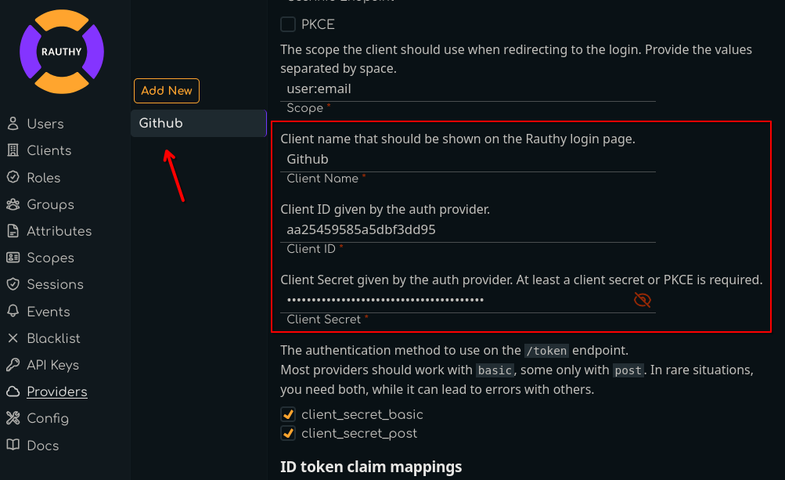

# GitHub Provider

To set up GitHub as an upstream provider for Rauthy, you have pretty little things to do.  
Rauthy includes a Template for GitHub already, which makes this whole process pretty simple.

## Create an OAuth App

1. Log in to your GitHub account
2. Navigate to
   [Settings -> Developer Settings -> OAuth Apps -> Register a new application](https://github.com/settings/applications/new)
3. Provide any name for your application. This is not important for the flow, only for your users to recognize
4. Homepage URL should be the URL of your Rauthy deployment
5. `Authorization callback URL` is the only really important one here. For instance, if your Rauthy instance would live
   at `https://iam.example.com`, your callback URL would be `https://iam.example.com/auth/v1/providers/callback`
6. Don't enable Device Flow and `Register application`

On the following page, you can upload a logo and so on, but the important information is:

- `Client ID`
- `Generate a new client secret`

Both of these values need to be inserted into Rauthy's Admin UI in the next step, so lets open this in a new tab.

## Rauthy Provider Config

1. Log in to your Rauthy Admin UI, navigate to `Providers` and add a new provier.
2. Choose `GitHub` as the `Type` and leave the Custom Root CA and insecure TLS unchecked.

3. The template pre-populates most of the inputs already for you. The only information you need to add here is
    - `Client ID` -> copy `Client ID` from the GitHub OAuth App page inside here
    - `Client Secret` -> on GitHub, `Generate a new client secret` and copy & paste the value
    - you may edit the `Client Name` if you want something else than `GitHub`

5. Leave the rest untouched and hit `Save`
5. You should expand the saved GitHub provider in the Rauthy UI again after saving and upload a Logo for the Client.
   Currently, Rauthy does not provide default Logos, though these might be added at some point. Just `UPLOAD LOGO` from
   your local disk.

## Finish

That's it. Now log out and try to log in to your Account view. You should see your new upstream provider on the Login
page.

