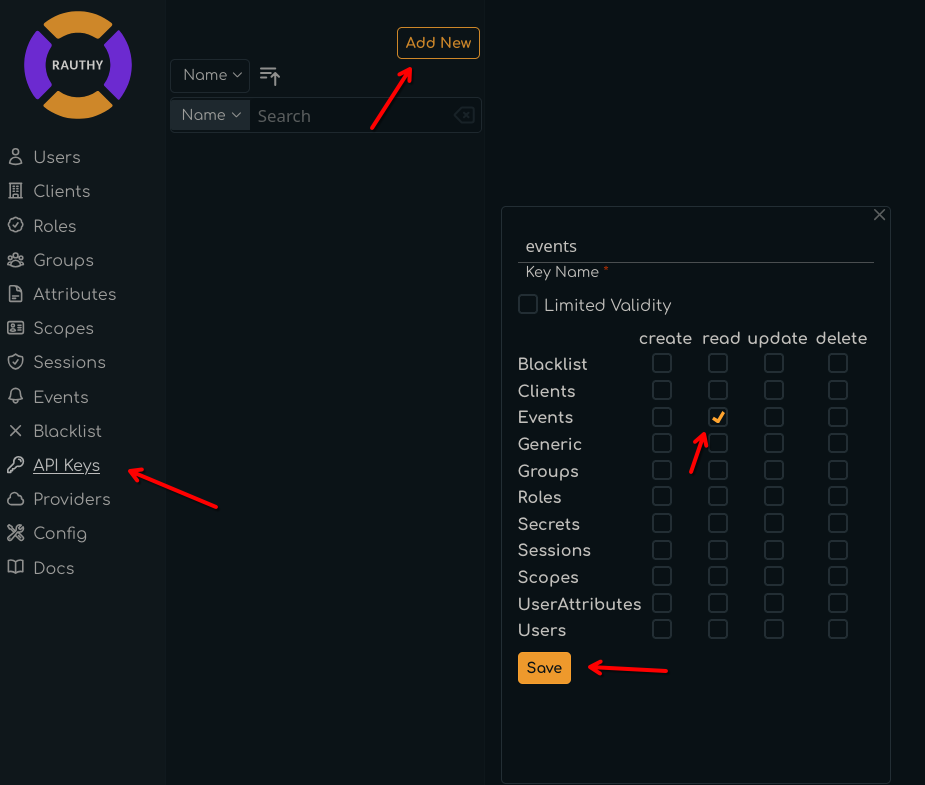
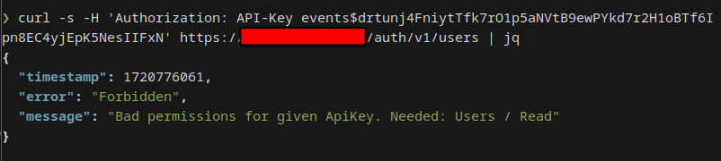

# API Keys

API Keys allow you to interact with Rauthy's REST API in a programmatic way. They allow you to do almost all the same
things as a logged in Admin via the UI is allowed to do. There are only very few exceptions, like for instance an API
Key is not allowed to manage other API Keys to reduce the impact of leaked credentials somewhere in your applications.

Each API Key can be configured with very fine-grained access rights, so you only allow actions it actually needs to
perform for improved security.

Setting these access rights should be very intuitive. For instance, if you want to use your API Key to listen to the
events stream, you need to allow *Events: read*, which makes sense. If you want to read users and maybe update them in
some external application, you would need *Users: read, update*.  
Most access rights requests mimic their HTTP methods:

- `GET` -> `read`
- `POST` -> `create`
- `PUT` -> `update`
- `DELETE` -> `delete`

To use an API Key, you need to provide is with the HTTP `Authorization` header, but instead of `Bearer` as prefix, you
set it to `API-Key`, so Rauthy can efficiently distinguish if you try to access the API with a JWT token or an API Key:

```
Authorization: API-Key <API Key name>$<API Key secret>
```

```
Authorization: API-Key my_key$twUA2M7RZ8H3FyJHbti2AcMADPDCxDqUKbvi8FDnm3nYidwQx57Wfv6iaVTQynMh
```

The correct format will be generated automatically, when you create a new secret for an API Key via the Admin UI, so
you only need to copy & paste it.

```admonish info
The only actions API Keys are not allowed to do is interacting with other API Keys and external SSO Providers for
logins to limit the likelyhood of priviledge escalation in case of leaked credentials. 
```

## Creating a new API Key

Apart from the initial [bootstrap](../config/bootstrap.md#api-key), the creation and modification of API Keys is only
allowed via the Admin UI.

Navigate to the `API Keys` section, click `New Key`, fill out the inputs and `Save`. You can set an optional key expiry.
By default, API Keys never expire.



The secret is created in a second step. Whenever you generate a new secret, the old one will stop working immediately.


After generating a new secret, you will never be able to see it again. If you loose it, you must generate a new one.
Rauthy will format the API key in the correct format and shows a `curl` command for making sure your key works fine.
You can copy & paste the pre-configured `curl` for the test endpoint. The result should look something like this:


If you try to access an endpoint with an API Key that has insufficient access rights, Rauthy will return a proper
error message with description, which access rights you actually need.


