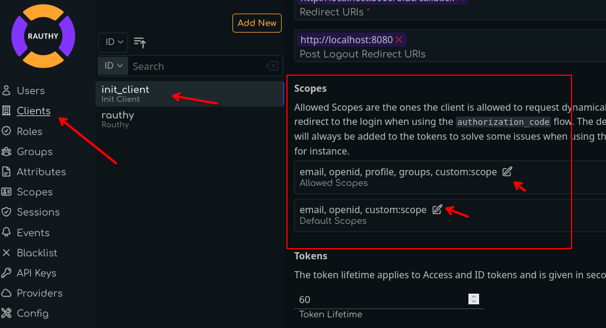

# Custom Scopes and Attributes

OpenID Connect defines quite a few very useful claims to be included in the `id_token` as additional information about
a user. However, there are times when you need other data as well, and maybe it is data that multiple downstream
applications need, like for instance an internal employee ID.

Rauthy can handle this as well. There are custom scopes you can create. These do not get mixed up with the default
scopes, so they can't interfere, which makes the whole setup pretty easy.

```admonish info
Users are not allowed to self-manage their custom scope values.  
This must be done by an admin.
```

Values are mapped as claims into tokens only if allowed an requested for an individual client. This means even if you
set a value for a user, it will not just end up in the token automatically. Let's walk through how you can achieve that.

## Custom User Attribute

The first thing we will do is to create a custom user attribute. Rauthy does not allow you to just enter anything you
like. All values are strictly typed and must be pre-configured to prevent user error during normal operation. For
instance, you won't be able to do typos, don't need copy & paste from other entries, and so on.

In the Admin UI, navigate to `Attributes` -> `Add New User Attribute`


The description is optional and can be changed at any time without any impact. The `name` of the attribute will be the
exact same in the JWT token later on.

## Set User Values

Now that we created our custom attribute in the step above, we can set them for users. Navigate to a user of your
choice, expand the entry and choose the `Attributed` tab.


```admonish info
The custom values for users are always interpreted, saved and returned `String`s without any further validation.
```

## Create a Custom Scope

The next thing we need is a custom scope we can map attributes to. You are not allowed to modify the OIDC default
scopes, but you can add your own ones, as many as you like. This is the first step we need to do. Navigate to the

Admin UI -> `Scopes` -> `Add New Scopes`


After saving, expand your just created scope. You want to map your attribute from the step before into JWT tokens
when a client requests (and is allowed to) this scope. For instance, let's add our new attribute to the `id_token`
with this custom scope.


We are almost done.

## Allow Scope for Client

The very last step is one you probably know. A client needs to be allowed to request certain scopes in the first place.
From this point on, the new custom scope behaves like any default one. We need to allow it for a client to be requested.

Open the configuration for any `Client` and scroll down until you see the `Allowed Scopes` and `Default Scopes` section.



The `Allowed Scopes` are the ones a client is allowed to request when redirecting a user to the authorization endpoint
to initiate the `authorization_code` flow. The `Default Scopes` are the ones that Rauthy will simply always add. This is
useful for instance when you are using `client_credentials` or another flow, because only the `authorization_code`
flow can request specific scopes while all others can't.

## Finish

That is it. It seems like many steps to follow, but it is to your advantage. With this setup you have type-safety and
the most flexibility about which client can see which values in which context, and so on.

When you have done everything right, you will see your new custom value in the `custom` section of the JWT token claims.
I used the `rauthy` client in this example (which you should not mess with when deployed).

```json
{
  "iat": 1721722389,
  "exp": 1721722399,
  "nbf": 1721722389,
  "iss": "http://localhost:8080/auth/v1",
  "sub": "za9UxpH7XVxqrtpEbThoqvn2",
  "aud": "rauthy",
  "nonce": "Fars0wPqrm9f6XimDKD08CPl",
  "azp": "rauthy",
  "typ": "Id",
  "amr": [
    "pwd"
  ],
  "auth_time": 1721722389,
  "at_hash": "Hd5ugcSzxwl1epF7Il3pEpq0gznnqs2SnSVZCdNw0EI",
  "preferred_username": "admin@localhost.de",
  "roles": [
    "rauthy_admin",
    "admin"
  ],
  "custom": {
    "my_attr": "This is Batman!"
  }
}
```
